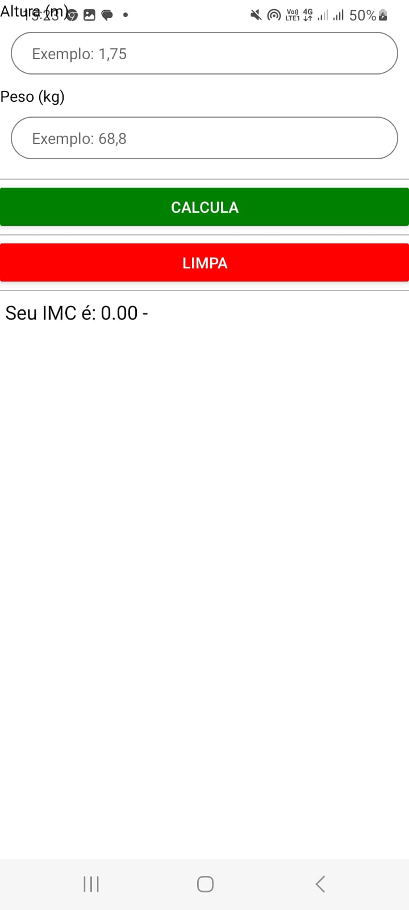

# calcuclaIMC-react-native
Projeto desenvolvido para o curso FIC originalmente por  https://github.com/marcelorcastro : calculaIMC 

# Como utilizar:
Crie seu projeto, por exemplo:
- expo init meuProjeto

Acesse a pasta do seu projeto
- cd ./meuProjeto

Inicie seu projeto com o yarn, por exemplo:
- npm start

Acesse a pasta do seu projeto e substitua o conteúdo do "App.js" pelo conteúdo do arquivo aqui disponibilizado.
